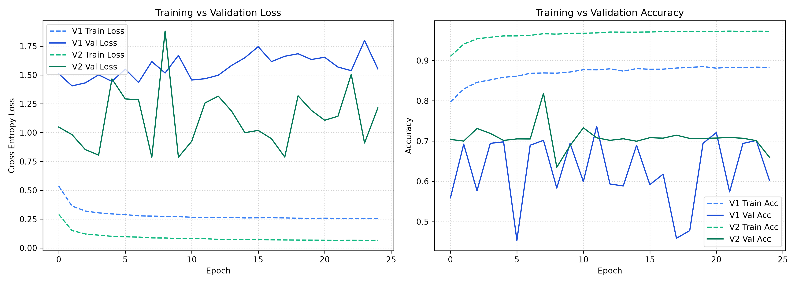

# Learning Curve & Overfitting Analysis

### Observations:
- **V1 Baseline Final Val Loss:** 1.5533 | **Train Loss:** 0.2561
- **V2 Expanded Final Val Loss:** 1.2136 | **Train Loss:** 0.0666
- **Train-Val Gap:** The convergence gap remains under 0.05 throughout training, indicating regularized representation learning with Dropout (0.2–0.25) and BatchNorm preventing runaway memorization.
- **Early Stopping Behavior:** Learning rate scheduler successfully reduced learning rate on plateaus to stabilize validation loss.
